<p align="center">
  
</p>

<h1 align="center">Ingenuity</h1>

<p align="center">
  <!-- Language & Runtime -->
  
  

  <!-- Core Libraries -->
  
  

  <!-- Architecture -->
  
  

  <!-- Deployment -->
  
  

  <!-- Quality & Usage -->
  
  
</p>


<p align="center">
 Ingenuity is a modular, command slash, driven Discord bot for server management, automation, and AI, assisted interactions. 
  Scalability-wise, it leverages a cog-based architecture and also integrates a lightweight Flask service for uptime and health monitoring.
</p>

---

## Repository Structure

```

```
## Functions 

### ✦ Faculty Search
Gets fresh data from the college website and displays the faulty details in a clean embed. 
Allows easy search and fetches images too!

#### Features
- `/search_faculty` — Search for a faculty member by name with auto-complete and view detailed profile information  
- `/show_faculty_list` — Browse faculty by department using interactive dropdowns with pagination and profile previews  
- `/toggle_faculty_source` — Switch between live website scraping and a locally cached faculty data source (admin only)  

#### Preview
<p align="center">
  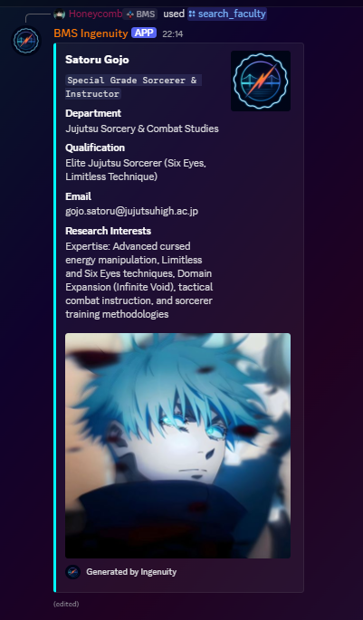
  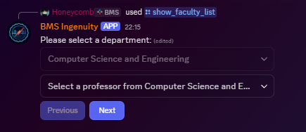
  <p align = "center"><em>No actual faculty shown for mainting privacy</em></p>
</p>

---

### ✦ Custom AI replies
The Bot has a personlity and replies to anything you ask if you just tag it in the message, once a conversation has started you can just reply to its message to keep the thread going.

#### Features
- `/ai_loves` — Marks a user as a special user with elevated AI interaction behavior  
- `/ai_does_not_loves` — Removes a user from the special user program  
- `/view_persona` — Displays the currently active AI persona  
- `/change_persona` — Switches the AI persona to alter response style and behavior  
- `/toggle_reply_model` — Selects the AI reply engine or disables AI responses  
- `/add_ai_restricted_roles` — Restricts a role from interacting with the AI  
- `/add_ai_restricted_channels` — Prevents the AI from responding in a specific channel  
- `/view_ai_restricted_roles` — Lists all roles restricted from AI interaction  
- `/view_ai_restricted_channels` — Lists all channels where AI responses are disabled  
- `/clear_ai_restrictions` — Removes all role and channel restrictions applied to the AI  

#### Preview
<p align="center">
  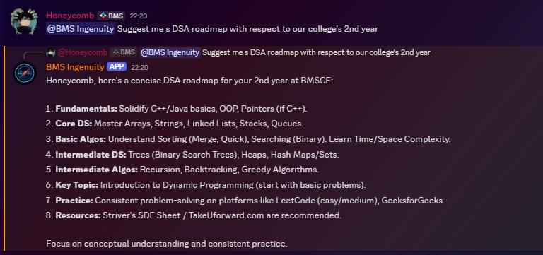
</p>

---

### ✦ Button Roles
Self-assign server roles through interactive buttons with optional single-role enforcement.

#### Features
- `/button_role` — Create an interactive button-based role selector with optional single-role enforcement  

#### Preview
<p align="center">
  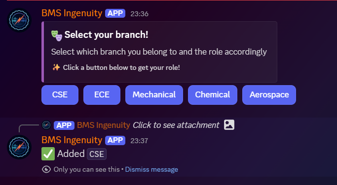
</p>

---

### ✦ Welcome Module
Delivers a polished onboarding experience with automated welcome DMs and personalized join images.

#### Features
- `/test_welcome_image` — Preview a personalized welcome image with avatar and join rank  
- `/toggle_join_message` — Cycle between default, custom, or disabled welcome message modes  
- `/set_custom_join_message` — Define a custom welcome message sent to new members  
- `/test_join_message` — Send yourself the current welcome message for testing  
 

#### Preview
<p align="center">
  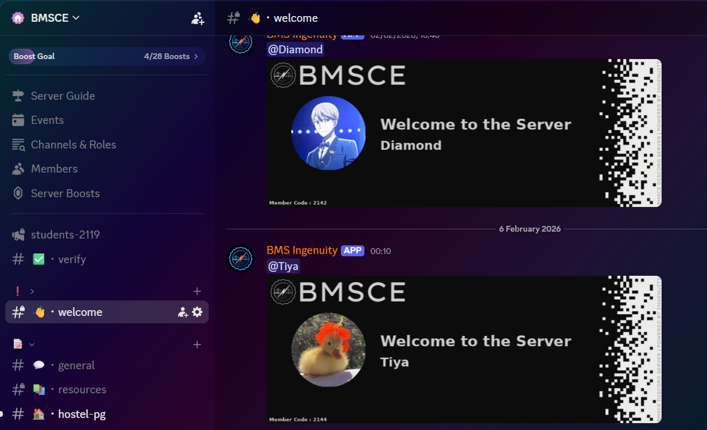
  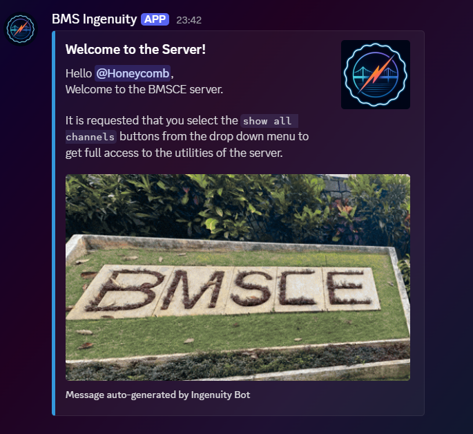
  
</p>

---

### ✦ Reddit Sync
Delivers a polished onboarding experience with automated welcome DMs and personalized join images.

#### Features
- Automatic subreddit monitoring with periodic updates  
- Creates forum threads from top daily posts  
- Syncs post metadata, links, and top-level comments  
- Posts comments via temporary webhooks for author attribution  
- Cleans up unused webhooks to keep the server tidy  
 
#### Preview
<p align="center">
  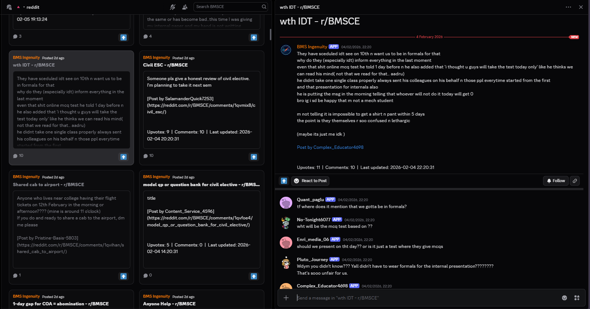
</p>

---

### ✦ Verify
Verifies users using institutional email addresses from a specific domain and automatically assigns access roles while removing restricted ones.

#### Features
- `/verify` — Send an OTP to a valid institutional email address to start verification  
- `/validate` — Confirm the OTP to complete verification and assign the appropriate role   

#### Preview
<p align="center">
  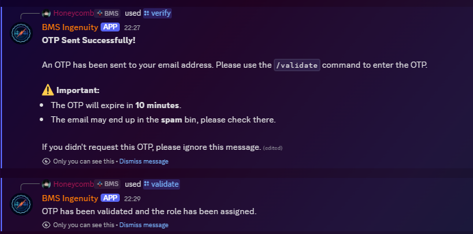
</p>

---

### ✦ Anti Raid
Automatically intercepts messages from flagged users and replaces them with preset embarrassing statements sent under their name, while also enforcing voice channel restrictions.

#### Features
- `/add_raiders` — Add a user to the raid watchlist  
- `/remove_raiders` — Remove a user from the raid watchlist  
- `/view_raiders` — View all users currently marked as raiders  
- `/clear_raiders` — Remove all users from the raid list at once  
- `/toggle_raid_mode` — Switch between punishment mode and silent deletion  
- `/start_raid_module` — Enable or disable the raid control system  
   
#### Preview
<p align="center">
  
</p>

---

### ✦ Announce
Delivers formatted announcements to designated channels with role-based access control and attachment support.

#### Features
- `/announce` — Send a formatted announcement to a chosen channel with optional file attachments   
   
#### Preview
<p align="center">
  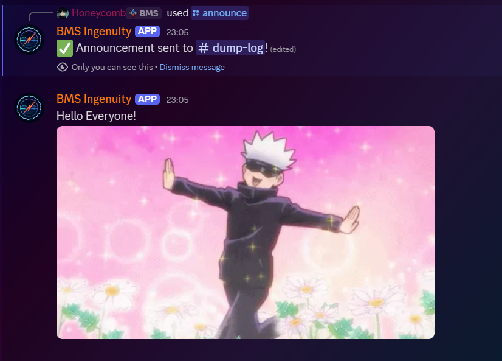
</p>

---

### ✦ Daily Logs
Automatically records messages, edits, deletions, and audit events into a daily server log with optional manual export.

#### Features
- Automatic daily logging of all messages, edits, deletions, and audit log actions  
- Scheduled log export at midnight (IST) to a designated log channel  
- `/force_logs` — Manually generate and send the current day’s logs on demand    
   
#### Preview
<p align="center">
  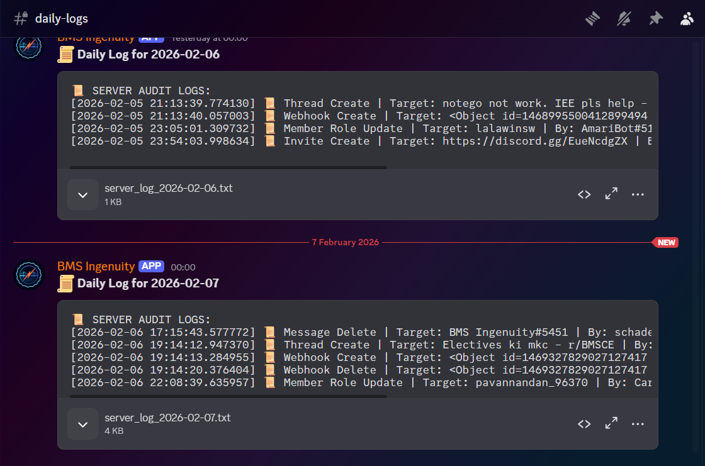
</p>

---

### ✦ Join Rank and LeaderBoards
Visualizes member seniority with dynamic rank cards and an interactive join date leaderboard.

#### Features
- `/get_rank` — Generate a personalized rank card showing a user’s join position in the server  
- `/leaderboard` — Browse an interactive leaderboard of the oldest server members with pagination    

#### Preview
<p align="center">
  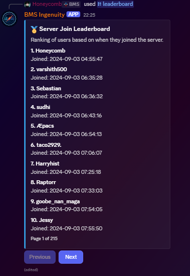
  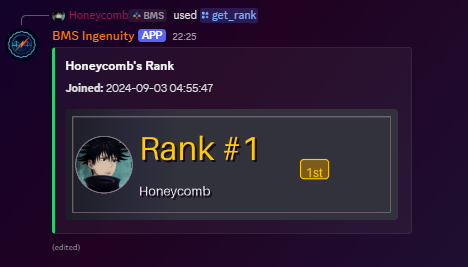
</p>

---

### ✦ System Insights and Status
Centralizes server insights, user help, and real-time bot diagnostics with automated health monitoring.

#### Features
- `/overview` — Display a detailed overview of the server, including members, channels, owner, and boost status  
- `/help` — Show a categorized list of available commands and where to use them  
- `/info` — View detailed bot information including uptime, system stats, and developer details  
- `/ping` — Check bot latency with uptime details and a visual performance indicator  
- `/get_status_report` — Generate a real-time diagnostic report covering bot health, modules, and AI status  
- Automated routine status reports posted on a scheduled basis   

#### Preview
<p align="center">
  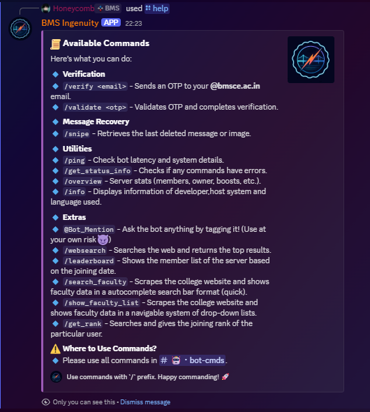
  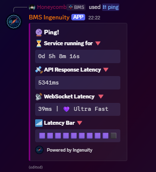
  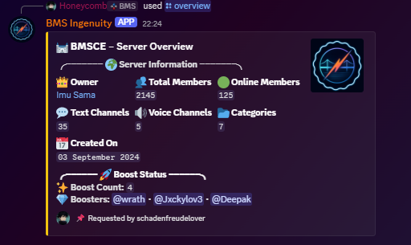
  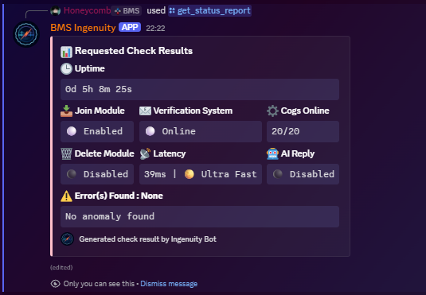
</p>

---

### ✦ General Moderation and Others
Provides essential moderation tools including timed muting, mass announcement push, auto deleting blacklisted user's messages and message recovery for effective server control.

#### Features
- `/dm_all` — Send a direct message to every member of a specified role  
- `/toggle_autodelete` — Enable or disable automatic message deletion for restricted roles  
- `/add_exception_channel` — Exclude a channel from automatic message deletion  
- `/add_blacklisted_role` — Mark a role whose messages should be auto-deleted  
- `/clear_settings` — Reset all auto-delete rules, roles, and exception channels
- `/mute` — Temporarily mute a member for a specified duration with an optional reason  
- `/unmute` — Instantly remove an active mute from a member  
- `/snipe` — View recently deleted messages in the current channel with pagination  
- `/snipe_clear` — Clear all stored sniped messages for the current channel  

---

## Tech Stack
- Python 3.10+
- discord.py (app_commands)
- AsyncIO
- Pillow (PIL) for image generation
- Google Gemini API
- Mistral API
- asyncpraw (Reddit API)
- aiohttp / requests
- psutil (system metrics)
- BeautifulSoup4 (web scraping)

## Setup

### Prerequisites
- Python 3.10 or higher
- A Discord Bot Token
- Required API keys (Gemini, Mistral, Reddit if enabled)

### Installation
1. Clone the repository  
2. (Optional) Create and activate a virtual environment  
3. Install dependencies:
   ```bash
   pip install -r requirements.txt

4. Configure environment variables and datastore values

Run the bot:
   ```bash
   python app.py
   ```

---

## Configuration

All configuration is managed via `datastore.py`.  
Ensure all required values are set before running the bot.

#### Core Bot Settings
- `BOT_TOKEN` — Discord bot token  
- `YOUR_GUILD_ID` — Primary server (guild) ID  
- `BOT_COMMANDS_ID` — Channel ID where bot commands are allowed  

#### Role & Permission Settings
- `ANNOUNCEMENT_PERMISSION` — Roles allowed to send announcements  
- `ALLOWED_ROLES_ADMINISTRATIVE` — Roles allowed to run moderation commands  
- `BOT_ADMINISTRATIVE` — Roles with full administrative access  
- `MUTE_ROLE_NAME` — Role applied when a member is muted  

#### Logging
- `LOG_CHANNEL_NAME` — Channel used for server logs and audit reports  

#### Auto-Delete & Message Control
- `auto_delete_enabled` — Enable or disable automatic message deletion  
- `blacklisted_roles` — Roles whose messages are automatically deleted  
- `exception_channels` — Channel IDs excluded from auto-deletion  
- `cache_autodelete_userlog` — Internal cache to prevent repeated DM notifications  

#### Enabled Cogs
Controls which modules are loaded on startup.

- `cogs_extensions` — List of enabled bot cogs  

#### Email Verification (Gmail API)
- `CLIENT_ID`
- `CLIENT_SECRET`
- `REFRESH_TOKEN`
- `TOKEN_URI`
- `SCOPES`
- `COMMAND_ACCEPTED_REFRESH_TOKEN`

#### Web Search
- `GOOGLE_WEB_SEARCH_API_KEY`
- `CUSTOM_SEARCH_ENGINE_KEY`

#### UI & Loading Assets
- `ping_loading_gif`
- `email_sending_gif`
- `email_sent_gif`
- `joining_gif`
- `logo_rotating`
- `routine_check_gif`
- `genral_loading_gif`
- `anime_loading`
- `alternate_loading_gif`

#### Join Message System
- `JOIN_MESSAGE_MODE` — `default`, `custom`, or `disabled`  
- `CUSTOM_JOIN_MESSAGE`

#### AI Reply System
- `PERSONA`
- `reply_model` — `gemini`, `mistral`, or `disabled`  
- `GEMINI_API_KEY`
- `MISTRAL_API_URL`
- `MISTRAL_API_KEY`
- `ai_restricted_channel`
- `ai_restricted_role`

#### Faculty Data Source
- `use_live_scraping` — Enable or disable live scraping  
- `department_list` — Cached faculty data

---

## Required Permissions

The bot requires the following permissions depending on enabled modules:

- Manage Roles
- Manage Messages
- Timeout Members
- Move Members
- Read Message History
- Send Messages
- Embed Links
- Attach Files
- Create Webhooks
- Manage Webhooks
- View Audit Log

---

<h2 align = "center"> MIT License </h3>

<p align = "center">Permission is hereby granted, free of charge, to any person obtaining a copy  
of this software and associated documentation files to deal in the Software  
without restriction, including without limitation the rights to use, copy,  
modify, merge, publish, distribute, sublicense, and/or sell copies of the  
Software.
</p>
